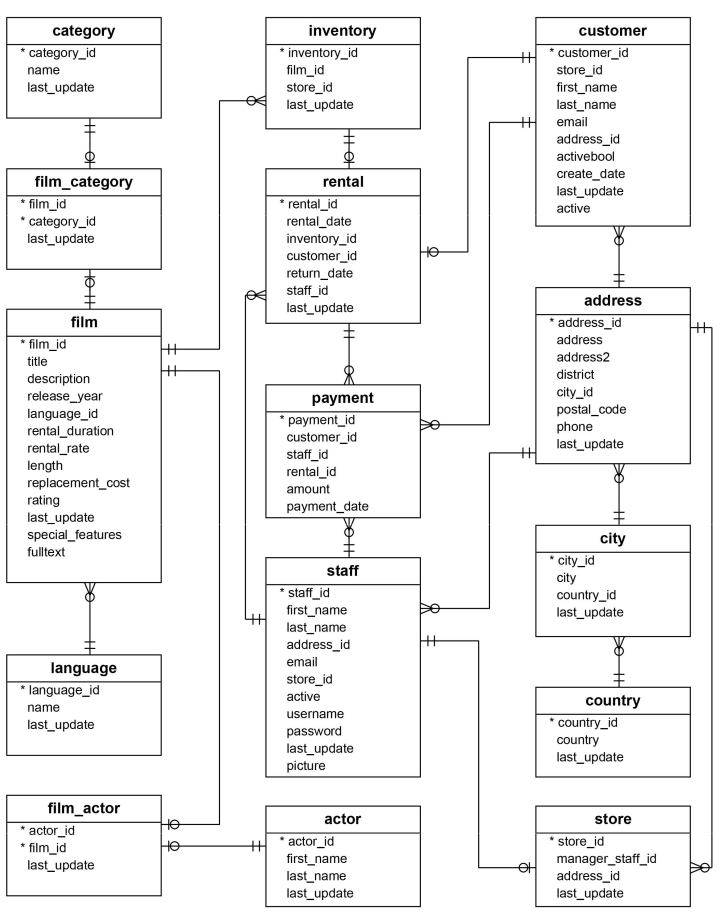

# postgres-database-migration

A sample migration process related scripts

You will find a various of SQL scripts regarding to create a sample database, define the defaul values like PK and FK notations. Finally the most common `view`, `function`, `procedure` samples.

The source code includes a `/data-correction` folder which has test-case sctipts for each table. The scripts idea has been inspired by [pgTAB project](https://pgtap.org/). The `pgTAB` project provides TDD (test driven development) approch to the PostgreSQL. You may find prepared the unit-test cases for the PostgreSQL databases.

The `/testing-helpers` folder (within `/data-correction`) will include a test-case template to make easy adapation to provide test case for any other table. Also the required functions which will be used by test-cases will be placed into the folder.

The `/install-scripts` folder is one the key resource within the structure. 

The install scripts aims to provide the seperation of concern for a better RESTORE approach. Here we divide script context into various main-topic (like views, functions, etc.). 

Thus, Database Administrator or any newbie to database structure person would adapt quickly.
Meanwhile we will have more robust generation process during any database creation or migration process.

The folder aim to be used only with `data-only` dump process!

#### Database info
- Target Server: PostgreSQL
- Server Version: 10

#### Project structure
- `/data-correction`: Includes test cases for each tablet to be run during migration process. 
    -`/testing-helpers`: Required testing-helper functions, etc.
- `/foreign-keys`: Includes all FKs within the database.
- `/functions`: Includes all functiones within the database.
- `/indexes`: Includes all indexes within the database.
- `/install-scripts`-scripts: Includes all scripts related to the RESTORE/migration process.
- `/media`: Includes EP diagram etc.
- `/primary-keys`: Includes all PKs within the database.
- `/sequence`: Includes all sequence within the database.
- `/tables`: Includes all tables within the database.
- `/triggers`: Includes all triggers within the database.
- `/views`: Includes all viewss within the database.

---

####  
[Diagram credit](https://www.postgresqltutorial.com/postgresql-sample-database/)
